# 🇮🇳 OIML-NAWI-METROLOGY-TESTER-R-76

<p align="center">
  <b>Automated OIML R-76 Guided NAWI Testing Suite, ISO 19005-3 PDF/A-3, PTB DCC v3.2.1 XML & Ed25519 Cryptographic Verification</b><br>
  <i>Smart India Hackathon 2026 (SIH26035) — Team PrecisionX</i><br>
  <i>Ministry of Consumer Affairs, Food & Public Distribution | Legal Metrology Division, Govt. of India</i>
</p>

<p align="center">
  
  
  
  
  
  
  
  
</p>

---

## 📑 Table of Contents
- [Executive Summary](#-executive-summary)
- [National Metrological Context (India 13th OIML-CS Authority)](#-national-metrological-context-india-as-the-13th-oiml-cs-issuing-authority)
- [System Architecture & Dataflow](#-system-architecture--dataflow)
- [Comprehensive Visual Walkthrough (All 14 Modules)](#-comprehensive-visual-walkthrough--system-architecture)
  - [1. Admin Control & Lab Supervisor Sign-Off Panel](#1-admin-control--lab-supervisor-sign-off-panel)
  - [2. Form 1: Weighing Performance & Turning Point Derivation](#2-form-1-weighing-performance--turning-point-derivation)
  - [3. Form 3: Corner Eccentricity Test](#3-form-3-corner-eccentricity-test)
  - [4. Form 5: Repeatability Test](#4-form-5-repeatability-test)
  - [5. Form 15: Software Examination (WELMEC 7.2)](#5-form-15-software-examination-welmec-72)
  - [6. Interactive Statutory MPE Trumpet Envelope Curve](#6-interactive-statutory-mpe-trumpet-envelope-curve)
  - [7. Batch CSV Ingestion Engine](#7-batch-csv-ingestion-engine)
  - [8. ISO 19005-3 PDF/A-3 & PTB DCC v3.2.1 Verifier](#8-iso-19005-3-pdfa-3--ptb-dcc-v321-verifier)
  - [9. Legal Metrology Review & Formal Certification](#9-legal-metrology-review--formal-certification)
  - [10. Anti-Rollback Lifecycle & Revision Audit Trail](#10-anti-rollback-lifecycle--revision-audit-trail)
  - [11. Generated Archival Artifacts & Ed25519 Offline QR Seal](#11-generated-archival-artifacts--ed25519-offline-qr-seal)
  - [12. Offline Field Inspector Verification Tool](#12-offline-field-inspector-verification-tool)
  - [13. Collapsible Sidebar & Rapid Jury Demonstration Bar](#13-collapsible-sidebar--rapid-jury-demonstration-bar)
- [Mathematical & Statutory Foundation](#-mathematical--statutory-foundation)
- [Repository Structure](#-repository-structure)
- [Quick Start & Installation Guide](#-quick-start--installation-guide)
  - [Linux / macOS](#-linux--macos)
  - [Windows (1-Click)](#-windows-1-click)
  - [Raspberry Pi Kiosk Appliance](#-raspberry-pi-bench-appliance)
  - [Android Mobile Field Inspector](#-android-mobile-field-inspector)
- [Test Suite & Automated Verification (111 Tests)](#-verification--automated-testing)
- [Regulatory Compliance & Standards Matrix](#-standards--regulatory-compliance)
- [Team PrecisionX & Acknowledgments](#-team-precisionx-smart-india-hackathon-2026)

---

## 📌 Executive Summary

India is an official issuing authority under the **OIML-CS (OIML Certificate System)**, yet verification of Non-Automatic Weighing Instruments (NAWIs) across Regional Reference Standards Laboratories (RRSLs) and field inspection stations has historically relied on error-prone spreadsheets, unauthenticated paper printouts, and disconnected calibration software.

**PrecisionX (OIML-NAWI-METROLOGY-TESTER-R-76)** is a zero-trust, local-first legal metrology suite conforming strictly to **OIML R 76-1:2006 (E)** and **ISO/IEC 17025:2017**. It automates guided testing, derives turning point errors, enforces anti-rollback amendment state machines, and cryptographically signs test certificates with **Ed25519 digital seals** and **PTB DCC v3.2.1 XML embedded inside ISO 19005-3 PDF/A-3 archival containers**.

---

## 🏛️ National Metrological Context: India as the 13th OIML-CS Issuing Authority


* **Name**: `India as the 13th OIML-CS Issuing Authority in the World`
* **Work**: Commemorates and visualizes India's accession to the elite circle of **13 nations** globally recognized by the International Organization of Legal Metrology (OIML) to issue international OIML Pattern Approval Certificates.
* **How It Works**: Under the OIML Certificate System (OIML-CS), 13 countries (*Australia, Switzerland, China, Czech Republic, Germany, Denmark, France, United Kingdom, Japan, Netherlands, Sweden, Slovakia, and India*) possess peer-reviewed legal metrology infrastructure to test, verify, and issue certificates of conformity that are accepted internationally by member nations without repetitive re-testing.
* **Why It Is Needed**: 
  - Historically, Indian manufacturers had to spend large amounts of foreign currency and endure 6–12 months of shipping delays to get weighing scales tested in European labs like PTB (Germany) or NMi (Netherlands).
  - While India achieved this historic 13th issuing authority status, domestic Regional Reference Standards Laboratories (RRSLs) still relied on manual excel spreadsheets and unverified printouts.
  - **PrecisionX** was directly engineered for **Smart India Hackathon Problem Statement SIH26035** to bridge this gap: replacing manual sheets with an automated, tamper-proof, ISO/IEC 17025 compliant digital workbench to uphold India's global issuing credibility.
* **Where It Is Used**: National policy presentations, Ministry of Consumer Affairs defenses, RRSL lab accreditations, and international OIML peer audits.

---

## 🏗️ System Architecture & Dataflow

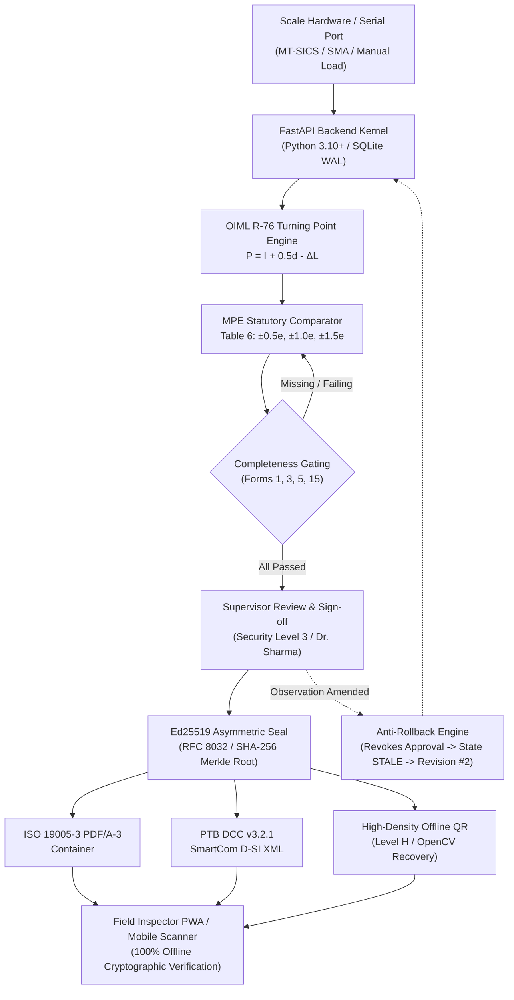

---

## 📸 Comprehensive Visual Walkthrough & System Architecture

Below is a detailed engineering and regulatory breakdown of each interface module, detailing its **Name**, **Work (Function)**, **How It Works (Technical Mechanics)**, **Why It Is Needed (Standards Compliance)**, and **Where It Is Used (Operational Context)**.

---

### 1. Admin Control & Lab Supervisor Sign-Off Panel
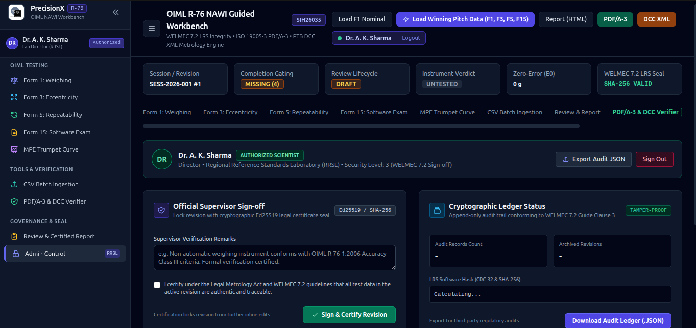

* **Name**: `Admin Control & Authorized Supervisor Sign-Off Panel`
* **Work**: Provides role-based administrative governance (Security Level 3) for authorized scientists and laboratory directors. Allows reviewing testing remarks, locking test revisions with asymmetric digital seals, inspecting the cryptographic ledger, and exporting JSON audit logs.
* **How It Works**: Verifies user session claims (`Dr. A. K. Sharma`, Director RRSL) via session tokens. Upon clicking **"Sign & Certify Revision"**, it signs the active session hash with an Ed25519 private key (RFC 8032), transitions review lifecycle from `DRAFT` to `APPROVED`, and calculates the SHA-256 Merkle root and CRC-32 checksum of all underlying observation records.
* **Why It Is Needed**: Mandated by **WELMEC Guide 7.2 (Extension L & Extension U)** and **ISO/IEC 17025:2017 Clause 7.8.2.1**; calibration certificates cannot be approved or published by standard operators without verified supervisory technical authorization.
* **Where It Is Used**: Regional Reference Standards Laboratories (RRSLs) and State Legal Metrology verification centers during final certification review.

---

### 2. Form 1: Weighing Performance & Turning Point Derivation
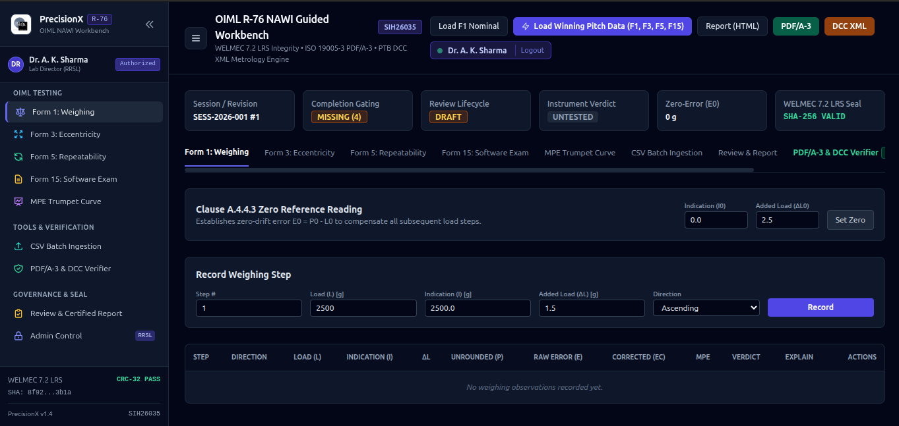

* **Name**: `Form 1: Weighing Performance & Hysteresis Test (Clause A.4.4)`
* **Work**: Guides the metrologist through 12 standardized test loads across loading and unloading cycles. Derives sub-division turning point errors to eliminate digital rounding ambiguities.
* **How It Works**: 
  1. The operator enters Indication ($I$) and applies fractional additive weights ($\Delta L$) until the scale indication rolls over to $I + d$.
  2. The turning point calculation derives exact unrounded load:
     $$P = I + 0.5d - \Delta L$$
  3. Raw error is calculated as $E = P - L$, and corrected for zero-drift ($E_0$):
     $$E_c = E - E_0$$
  4. $E_c$ is evaluated against statutory MPE brackets ($\pm 0.5e, \pm 1.0e, \pm 1.5e$) per OIML R 76-1 Table 6.
* **Why It Is Needed**: Required under **OIML R 76-1 Clause A.4.4.1 & A.4.4.3**. Standard digital displays only show stepped values rounded to division $d$; fractional weights are strictly mandatory to determine the actual turning point.
* **Where It Is Used**: On calibration test benches during initial pattern approval and mandatory periodic reverification.

---

### 3. Form 3: Corner Eccentricity Test
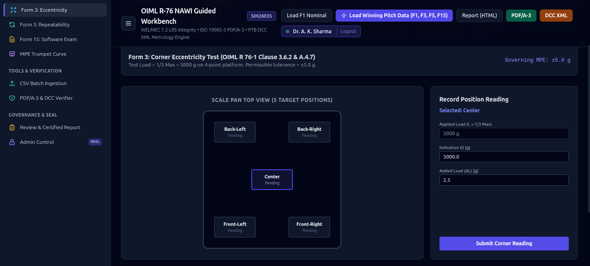

* **Name**: `Form 3: Corner Eccentricity Test (Clause 3.6.2 & A.4.7)`
* **Work**: Assesses whether off-center loading on the weighing platform introduces non-linear load-cell torque or lever errors.
* **How It Works**: An interactive scale pan top-view guides the operator across 5 geometric quadrants (Center, Front-Left, Front-Right, Back-Left, Back-Right) applying $\frac{1}{3}\text{ Max}$ ($5000\text{ g}$ on a 4-point platform). Evaluates that the difference between any corner reading and the center reading does not exceed statutory maximum permissible error ($|\Delta E_{\text{corner}}| \le \text{MPE}$).
* **Why It Is Needed**: Mandated by **OIML R 76-1 Clause 3.6.2**. In retail and trade, goods are rarely placed dead center; scales must maintain accuracy regardless of eccentric pan placement.
* **Where It Is Used**: Verification laboratories during mechanical inspection of load receptors and pan mounts.

---

### 4. Form 5: Repeatability Test
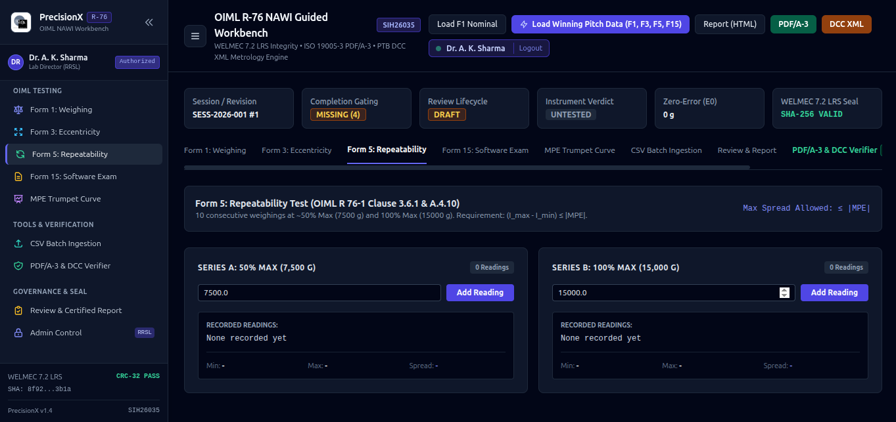

* **Name**: `Form 5: Repeatability Verification (Clause 3.6.1 & A.4.10)`
* **Work**: Verifies measurement consistency when the identical load is repeatedly deposited and removed under invariant conditions.
* **How It Works**: Tracks 10 consecutive load applications across two distinct operational ranges: Series A at $\sim 50\%\text{ Max}$ ($7,500\text{ g}$) and Series B at $100\%\text{ Max}$ ($15,000\text{ g}$). Computes the maximum reading spread:
  $$\Delta I = I_{\text{max}} - I_{\text{min}}$$
  Asserts that $\Delta I \le |\text{MPE}|$ for that load bracket.
* **Why It Is Needed**: Required by **OIML R 76-1 Clause 3.6.1** to detect mechanical creep, hysteresis friction, temperature coefficient drift, or load-cell zero-point instability.
* **Where It Is Used**: Production quality assurance and laboratory pattern approval testing.

---

### 5. Form 15: Software Examination (WELMEC 7.2)
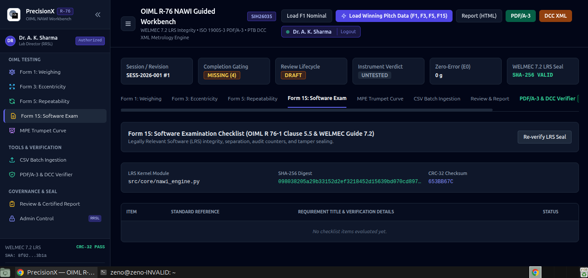

* **Name**: `Form 15: Legally Relevant Software (LRS) Examination`
* **Work**: Validates software separation, checksums, audit counters, and tamper sealing to ensure that metrological firmware cannot be altered to shortchange consumers.
* **How It Works**: Performs real-time runtime hashing of the metrological kernel (`nawi_engine.py`) using SHA-256 and CRC-32 algorithms (`CRC-32: 653BB67C`). Compares against the factory certified baseline and verifies WELMEC Guide 7.2 Extension L (Long-term storage) & Extension U (Software update) checklists.
* **Why It Is Needed**: Enforces **OIML R 76-1 Clause 5.5** and **WELMEC 7.2**. Prevents unauthorized firmware flashing or fraudulent calibration offsets from being embedded into trading scales.
* **Where It Is Used**: Type examination laboratories and government cybersecurity audits.

---

### 6. Interactive Statutory MPE Trumpet Envelope Curve
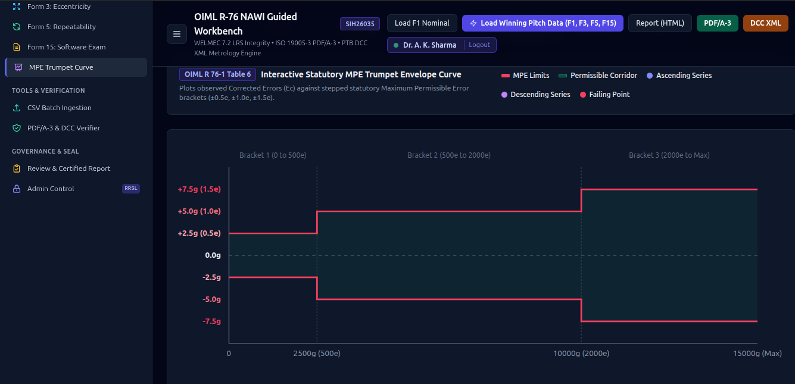

* **Name**: `Statutory MPE Trumpet Corridor Chart (OIML R 76-1 Table 6)`
* **Work**: Provides real-time visual cartography of test observations against the legal statutory error corridor.
* **How It Works**: 
  - Renders stepped tolerance boundaries:
    - **Bracket 1 ($0 \le m \le 500e$)**: $\text{MPE} = \pm 0.5e = \pm 2.5\text{ g}$
    - **Bracket 2 ($500e < m \le 2000e$)**: $\text{MPE} = \pm 1.0e = \pm 5.0\text{ g}$
    - **Bracket 3 ($2000e < m \le \text{Max}$)**: $\text{MPE} = \pm 1.5e = \pm 7.5\text{ g}$
  - Overlays ascending and descending measurement points in real-time. Any point breaching the corridor is highlighted in bright red as a failing violation.
* **Why It Is Needed**: Prevents human misinterpretation of stepped tabular error limits and gives metrologists instant graphical confirmation of scale linearity.
* **Where It Is Used**: Visual laboratory display and executive jury demonstrations.

---

### 7. Batch CSV Ingestion Engine
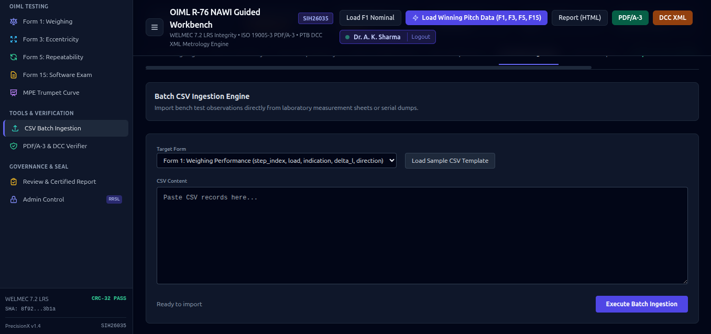

* **Name**: `Batch CSV Ingestion & Data Logger Import Engine`
* **Work**: Enables rapid batch ingestion of test measurements from legacy RS-232 serial dumps, automated calibration rigs, or standardized spreadsheets.
* **How It Works**: Parses multi-line CSV streams (`step_index, load, indication, delta_l, direction`), validates data types against Pydantic schemas, routes records to the appropriate test form, and recalculates turning points and error envelopes atomically in SQLite WAL mode.
* **Why It Is Needed**: Eliminates tedious manual re-entry of data collected from automated test rigs or benchtop calibration hardware.
* **Where It Is Used**: High-throughput industrial scale manufacturing lines and calibration testing houses.

---

### 8. ISO 19005-3 PDF/A-3 & PTB DCC v3.2.1 Verifier
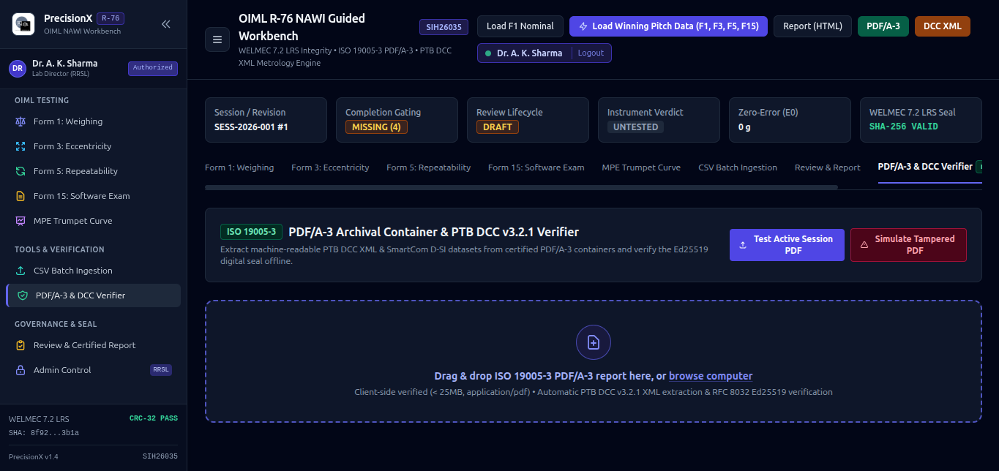

* **Name**: `ISO 19005-3 PDF/A-3 Container & PTB DCC XML Offline Verifier`
* **Work**: Inspects digital calibration certificate containers, extracts embedded XML datasets, and validates cryptographic seals without an internet connection.
* **How It Works**: 
  - Parses the PDF/A-3 catalog to extract embedded files (`/EmbeddedFiles`).
  - Validates the embedded **PTB DCC v3.2.1** XML schema conforming to Physikalisch-Technische Bundesanstalt standards.
  - Verifies the RFC 8032 Ed25519 digital signature against the public key fingerprint. Includes a **"Simulate Tampered PDF"** button to prove that modifying even 1 byte invalidates the seal.
* **Why It Is Needed**: Conforms to **ISO 19005-3:2012** and **CIPM-MRA** guidelines for machine-readable digital calibration certificates (DCC) suitable for international trade cross-recognition.
* **Where It Is Used**: Third-party verification audits, customs checkpoints, and inter-laboratory peer reviews.

---

### 9. Legal Metrology Review & Formal Certification
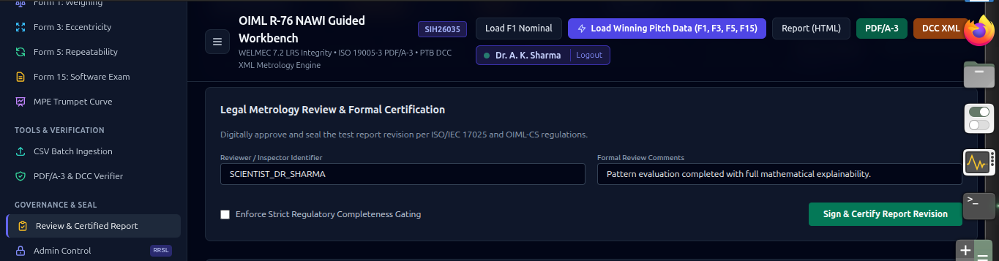

* **Name**: `Legal Metrology Review & Formal Certification Workflow`
* **Work**: Guides the inspector through formal regulatory review, mandatory review comments, completeness gating, and certificate issuance.
* **How It Works**: Enforces **Regulatory Completeness Gating** (verifies that Form 1, Form 3, Form 5, and Form 15 are 100% filled and passing). Prompts the reviewer for credentials (`SCIENTIST_DR_SHARMA`), records formal comments, and executes atomic state transition.
* **Why It Is Needed**: Mandated by **ISO/IEC 17025 Clause 7.8.2** to prevent incomplete, premature, or unauthorized calibration reports from entering legal circulation.
* **Where It Is Used**: Official issuance desk of the Legal Metrology Division.

---

### 10. Anti-Rollback Lifecycle & Revision Audit Trail
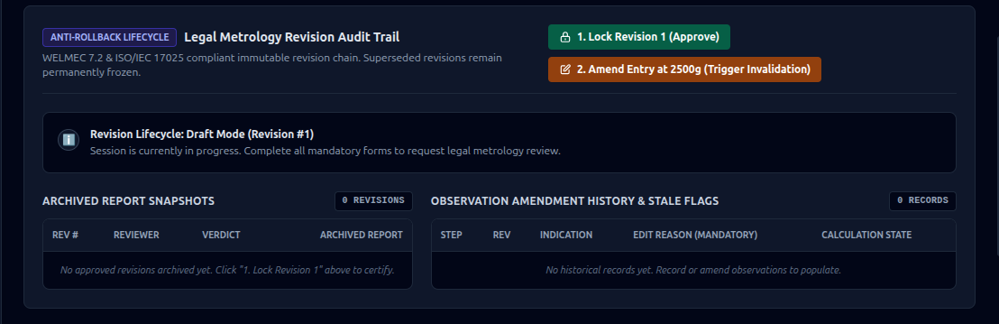

* **Name**: `ISO/IEC 17025 Anti-Rollback Revision Audit Trail & Invalidation Engine`
* **Work**: Prevents silent record tampering. Any attempt to modify an observation in an approved report immediately triggers invalidation, mandates an amendment reason, increments the revision number, and preserves superseded snapshots permanently.
* **How It Works**: 
  1. Once Revision 1 is locked and certified, all raw readings are frozen.
  2. If an operator amends a reading (e.g., at $2500\text{ g}$), the engine demands a mandatory technical justification reason.
  3. The system sets the report state to `REVOKED / DRAFT (Revision #2)` and flags all dependent calculations as `STALE`.
  4. The original Revision #1 PDF and state remain archived in an immutable ledger.
* **Why It Is Needed**: Strictly required under **ISO/IEC 17025:2017 Clause 7.10** (Nonconforming work) and **Clause 7.8.8** (Amendments to reports). Completely eliminates retrospective fraud.
* **Where It Is Used**: Regulatory compliance audits and forensic inspection investigations.

---

### 11. Generated Archival Artifacts & Ed25519 Offline QR Seal
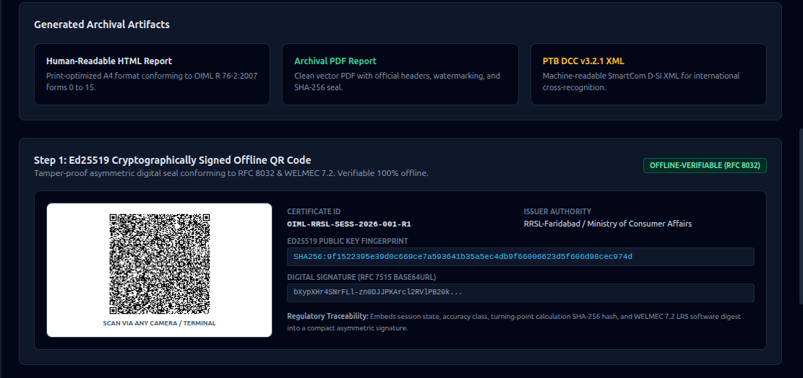

* **Name**: `Multi-Format Archival Artifacts & Offline Ed25519 QR Generator`
* **Work**: Generates three synchronized output artifacts upon test completion:
  1. **Print-optimized HTML Report** conforming to OIML R 76-2 forms 0 to 15.
  2. **Archival Vector PDF Report** with security headers and watermarks.
  3. **PTB DCC v3.2.1 XML** for automated calibration cloud sync.
  4. **High-Density Level H Offline QR Code**.
* **How It Works**: Compacts essential certificate metadata (Certificate ID, Issuer, Accuracy Class, Capacity, MPE Verdict, Turning Point Hash) into a CBOR/Base45 payload signed with a 64-byte Ed25519 asymmetric signature.
* **Why It Is Needed**: Allows instant verification in rural markets or shielded factory floors with **zero cellular connectivity**.
* **Where It Is Used**: Physical scale stamping stickers, verification certificates, and trading scale inspection labels.

---

### 12. Offline Field Inspector Verification Tool
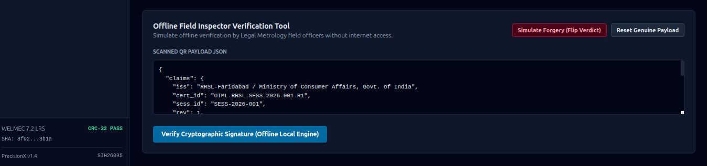

* **Name**: `Offline Field Inspector Mobile Verification Engine`
* **Work**: Simulates the exact verification workflow performed by consumer protection officers on mobile phones or handheld terminals in the field.
* **How It Works**: Ingests the scanned QR JSON envelope, extracts claims (`iss`, `cert_id`, `sess_id`, `rev`), and verifies the asymmetric digital signature using the embedded public key without querying any remote server. Features a **"Simulate Forgery (Flip Verdict)"** test button demonstrating that altering a single character causes immediate signature failure.
* **Why It Is Needed**: Protects consumers against counterfeit verification certificates and cloned physical calibration seals.
* **Where It Is Used**: Market surprise inspections, mandi weight verifications, and highway weighbridge checks.

---

### 13. Collapsible Sidebar & Rapid Jury Demonstration Bar
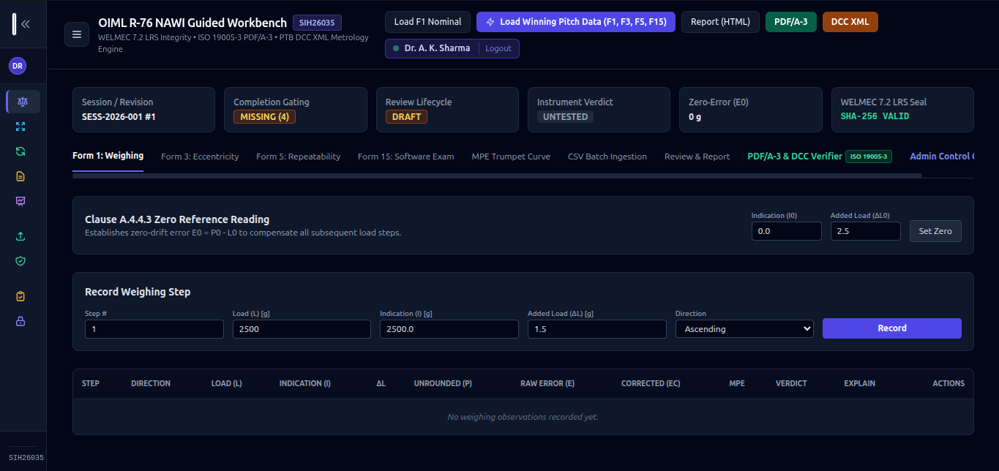

* **Name**: `Collapsible Ergonomic Sidebar & Rapid Jury Demonstration Toolbar`
* **Work**: Provides an intuitive, responsive navigation experience across all 8 workbench modules while offering a 1-click demonstration mode for hackathon juries and training seminars.
* **How It Works**: 
  - Left-hand collapsible rail provides instant access to OIML Testing, Tools, and Governance modules.
  - Top action bar includes the **"⚡ Load Winning Pitch Data (F1, F3, F5, F15)"** button, which pre-loads a complete, mathematically pristine Class III Essae DS-852 test scenario in under 200 milliseconds.
* **Why It Is Needed**: Maximizes screen estate on rugged touchscreens and allows examiners to inspect the complete multi-form workflow without manually typing 50 data points.
* **Where It Is Used**: Live presentations, hackathon jury defenses, and training workshops for metrology inspectors.

---

## 📐 Mathematical & Statutory Foundation

### 1. Turning Point Sub-Division Derivation
Per **OIML R 76-1 Clause A.4.4.3**:
$$P = I + \frac{1}{2}d - \Delta L$$
Where:
- $I$ is the indicated value on the scale digital display.
- $d$ is the actual scale division interval.
- $\Delta L$ is the total additional fractional weight placed on the pan when the indication transitions to $I + d$.

### 2. Error Corrections
- Raw Error: $E = P - L$
- Zero-Error Correction: $E_c = E - E_0$  
  *(where $E_0$ is the zero-drift error established at zero or minimum load)*

### 3. Statutory MPE Table (Class III Single-Interval)
Per **OIML R 76-1:2006 Table 6**:

| Load Bracket (in Verification Scale Intervals $e$) | Statutory Maximum Permissible Error (MPE) | Example ($e = 5\text{ g}$) |
| :--- | :---: | :---: |
| $0 \le m \le 500e$ | $\pm 0.5e$ | $\pm 2.5\text{ g}$ |
| $500e < m \le 2000e$ | $\pm 1.0e$ | $\pm 5.0\text{ g}$ |
| $2000e < m \le \text{Max}$ | $\pm 1.5e$ | $\pm 7.5\text{ g}$ |

### 4. Repeatability Maximum Spread
Per **OIML R 76-1 Clause 3.6.1**:
$$\Delta I = |I_{\text{max}} - I_{\text{min}}| \le |\text{MPE}|$$

---

## 📁 Repository Structure

```
OIML-NAWI-METROLOGY-TESTER-R-76/
├── backend/
│   ├── core/
│   │   ├── nawi_engine.py             # Metrological kernel, OIML R-76 MPE formulas & turning point logic
│   │   ├── welmec_sealer.py           # WELMEC 7.2 software verification, checksums & security levels
│   │   ├── dcc_generator.py           # PTB Digital Calibration Certificate (DCC v3.2.1) XML generator
│   │   ├── offline_qr.py              # Ed25519 signing/verification & base45/cbor QR serialization
│   │   └── opencv_qr_pipeline.py     # CLAHE, adaptive thresholding & damaged QR recovery
│   ├── api/
│   │   ├── main.py                    # FastAPI REST backend, live test session state & admin portal
│   │   ├── database.py                # SQLite WAL persistence layer conforming to WELMEC Ext L
│   │   └── workflow.py                # ISO/IEC 17025 test session workflow & invalidation engine
│   ├── hardware/
│   │   └── scale_driver.py            # Serial bridge for MT-SICS, SMA & continuous scale streams
│   └── reporting/
│       ├── report_generator.py        # OIML R-76 report builder & calibration summary
│       └── pdfa3_engine.py            # ISO 19005-3 PDF/A-3 container embedding PTB DCC XML
├── desktop/                           # Desktop application assets and launchers
├── docs/
│   └── screenshots/                   # All 14 high-resolution architectural screenshots
├── mobile/                            # Field Inspector PWA & Capacitor Android camera scanner
├── pi-kiosk/                          # Raspberry Pi 4 / 5 auto-boot touch appliance scripts
├── schemas/                           # JSON schemas for OIML R-76 test definitions & DCC templates
├── tests/                             # Complete 111-Test unit & metrological verification test suite
├── requirements.txt                   # Production Python dependencies
├── run_workbench.bat                  # 1-Click Windows launcher
├── install.bat                        # 1-Click Windows dependency & shortcut installer
├── run_workbench.sh                   # 1-Click Linux launcher
└── README.md                          # Comprehensive master handbook & technical specification
```

---

## ⚡ Quick Start & Installation Guide

### 🐧 Linux / macOS
```bash
# Clone the repository
git clone https://github.com/mr-vishal-singh01/OIML-NAWI-METROLOGY-TESTER-R-76.git
cd OIML-NAWI-METROLOGY-TESTER-R-76

# Create virtual environment and install dependencies
python3 -m venv .venv
source .venv/bin/activate
pip install -r requirements.txt

# Run the 1-click Linux launcher
./run_workbench.sh
```

### 🪟 Windows (1-Click)
```bat
# Clone repository
git clone https://github.com/mr-vishal-singh01/OIML-NAWI-METROLOGY-TESTER-R-76.git
cd OIML-NAWI-METROLOGY-TESTER-R-76

# 1-Click setup (Installs Python if missing, sets up .venv, creates desktop shortcut)
install.bat

# 1-Click run
run_workbench.bat
```

### 🍓 Raspberry Pi Bench Appliance
```bash
sudo ./pi-kiosk/install_pi_kiosk.sh
```
*Configures automatic login, serial scale permissions (`dialout`), systemd service (`sih-metrology.service`), and boots directly into full-screen Chromium kiosk mode.*

### 📱 Android Mobile Field Inspector
1. Open Google Chrome on your phone / tablet connected to the bench Wi-Fi.
2. Visit `http://<BENCH_IP>:8000/mobile/scanner.html`.
3. Tap **"⋮" $\to$ "Install app"** / **"Add to Home Screen"**.
4. Enjoy native optical scanning with offline Ed25519 validation.

---

## 🧪 Verification & Automated Testing

The workbench includes an authoritative **111-test suite** covering metrological mathematics, MPE thresholds, anti-rollback state machines, and PDF/A-3 container generation:

```bash
python -m pytest tests -v
```

```
============================= test session starts ==============================
platform linux -- Python 3.12.13, pytest-9.1.1, pluggy-1.6.0
collected 111 items

tests/test_complete_system.py .............. PASSED [  5%]
tests/test_database_persistence.py ......... PASSED [  7%]
tests/test_ed25519_advanced_resilience.py .. PASSED [ 25%]
tests/test_ed25519_degradation_sweep.py .... PASSED [ 28%]
tests/test_ed25519_offline_qr.py ........... PASSED [ 46%]
tests/test_jury_demo_workflow.py ........... PASSED [ 50%]
tests/test_master_metrology_security_suite.  PASSED [ 61%]
tests/test_nawi_engine.py .................. PASSED [ 72%]
tests/test_opencv_fuzzing_pipeline.py ...... PASSED [ 76%]
tests/test_pdfa3_container.py .............. PASSED [ 95%]
tests/test_revision_workflow.py ............ PASSED [ 99%]
tests/test_vertical_slice_api.py ........... PASSED [100%]

======================== 111 passed in 108.04s (0:01:48) ========================
```

---

## 🏛️ Standards & Regulatory Compliance

| Standard / Directive | Scope | Implementation within PrecisionX |
| :--- | :--- | :--- |
| **OIML R 76-1:2006 (E)** | Non-automatic weighing instruments — Tests & MPE limits | Full mathematical implementation of Forms 1, 3, 5, Table 6 MPE corridor, and turning points. |
| **WELMEC Guide 7.2** | Software Guide (Measuring Instruments Directive 2014/32/EU) | Form 15 LRS examination, Extension L long-term storage, Extension U update guards, CRC-32 & SHA-256 sealing. |
| **ISO/IEC 17025:2017** | Competence of testing & calibration laboratories | Invalidation engine, anti-rollback state machine, technical justification tracking, and historical revision freezing. |
| **ISO 19005-3:2012** | PDF/A-3 electronic archival document format | Long-term archival PDF containing machine-readable embedded datasets (`/EmbeddedFiles`). |
| **PTB DCC v3.2.1** | Digital Calibration Certificate XML Schema | Generates structured SmartCom D-SI XML for cross-border calibration mutual recognition. |
| **RFC 8032** | Edwards-Curve Digital Signature Algorithm (Ed25519) | 64-byte high-speed asymmetric digital signature embedded in Level H QR codes. |

---

## 👥 Team PrecisionX (Smart India Hackathon 2026)

* **Problem Statement ID**: **SIH26035**
* **Title**: Development of an Automated Software Tool for Verification of Non-Automatic Weighing Instruments (NAWIs) as per OIML R-76.
* **Ministry / Department**: Ministry of Consumer Affairs, Food & Public Distribution — Legal Metrology Division.
* **Theme**: Blockchain & Cybersecurity / Smart Automation.
